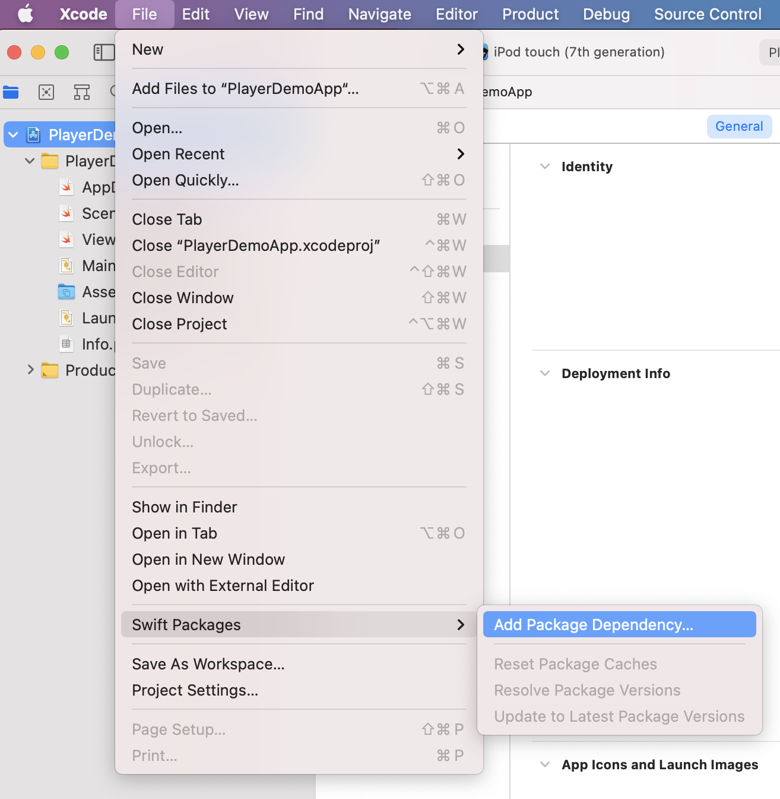
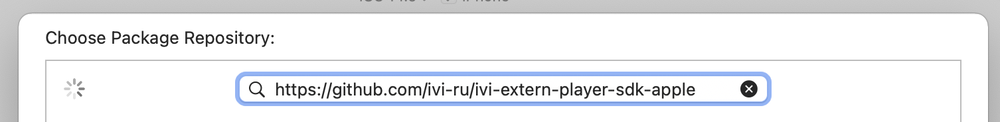
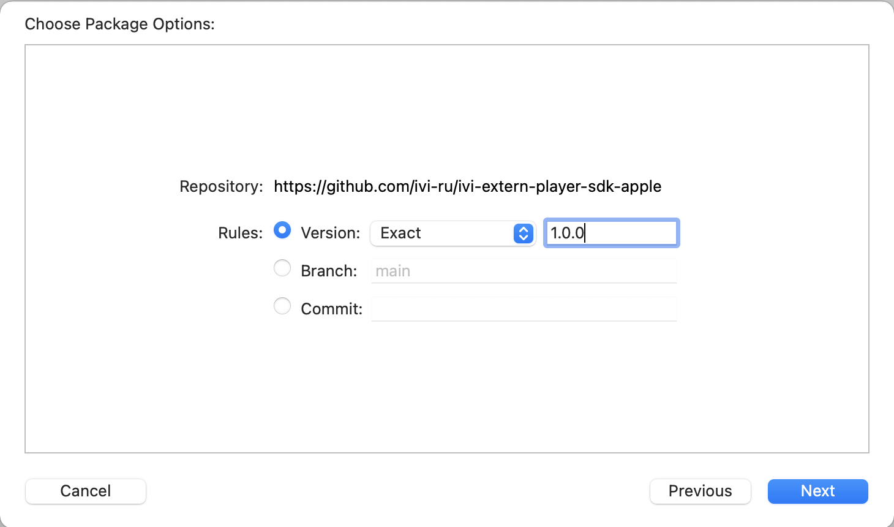
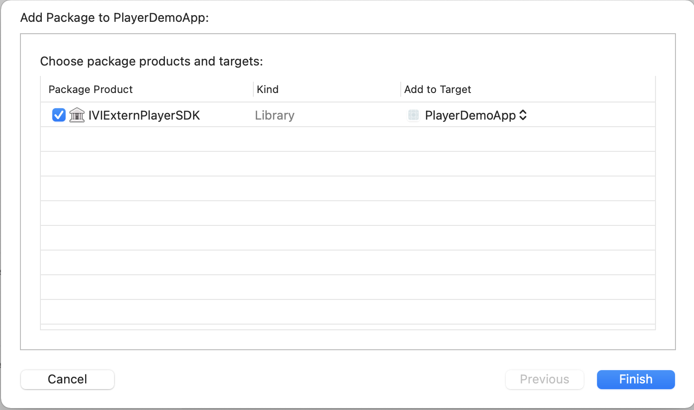
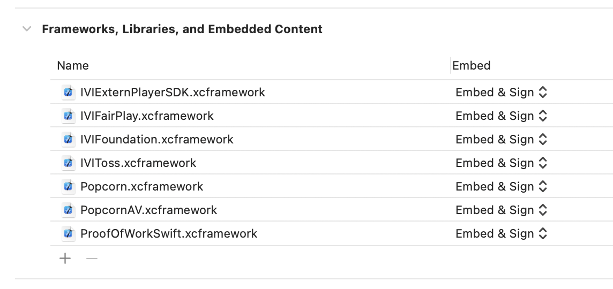

# IVIExternPlayerSDK

SDK позволяет интегрировать плеер IVI в сторонние приложения.

## Требования
 * iOS 13.0 и выше
 * В `Info.plist` приложения должен быть выставлен флаг:
 
 ```
 <key>NSAppTransportSecurity</key>
 <dict>
     <key>NSAllowsArbitraryLoads</key>
     <true/>
 </dict>
 ```

## Установка 
 
 ### Swift Package Manager
 
 Является предпочтительным способом установки SDK.
 
 IVIExternPlayerSDK поддерживает подключение через [Swift Package Manager](https://swift.org/package-manager/). 
 
 Для того, чтобы подключить IVIExternPlayerSDK к своему проекту необходимо выбрать в Xcode пункт меню `File -> Swift Packages -> Add Package Dependency...`
 
 
 
 Ввести адрес GitHub-репозитория SDK - `https://github.com/ivi-ru/ivi-extern-player-sdk-apple`
 
 
 
 Выбрать необходимую версию SDK
 
 
 
 Добавить IVIExternPlayerSDK к таргету
 
 
 
 ### Ручная установка
 
 Необходимо добавить в проект фреймворк `IVIExternPlayerSDK.xcframework`, а также фреймворки, которые используются как его зависимости:
 
 * `Asset.xcframework`
 * `SwiftProtobuf.xcframework`
 * `Utils.xcframework`
 * `Interfaces.xcframework`
 * `AccessibilityScreens.xcframework`
 * `ProofOfWorkSwift.xcframework`
 * `Sentinel.xcframework`
 * `IVIToss.xcframework`
 * `IVIFairPlay.xcframework`
 * `PopcornAV.xcframework`
 * `Popcorn.xcframework`
 * `Comet.xcframework`

Для каждого из них должна быть выставлена настройка _Emded & Sign_ в разделе _Frameworks, Libraries, and Embedded Content_ вкладки _General_ соответствующего таргета проекта:


    
## Пример использования

```swift
import IVIExternPlayerSDK

class ViewController: UIViewController {
    
    private var player: IVIExternPlayer!
    
    override func viewDidLoad() {
        super.viewDidLoad()
        
        // Данные для структуры `IVIAppInfo` уникальны для каждого приложения 
        // и выдаются менеджером IVI.
        let appInfo = IVIAppInfo(subsite: 123,
                                 appVersion: 12345,
                                 requestKeys: IVIAppInfo.RequestKeys(k: "qwerty123n",
                                                                     k1: "qwerty1n",
                                                                     k2: "qwerty2n"),
                                 app: nil)
                                 
        // Инициализируем плеер с конфигурационными данными.
        let configuration = IVIPlayerConfiguration(appInfo: appInfo,
                                                   userSession: "valid_ivi_user_session",
                                                   allowsAirPlay: true,
                                                   isNativeVolumeIndicationEnabled: false)
        player = IVIExternPlayer(configuration: configuration)
        
        // Подписываемся на события плеера.
        player.delegate = self

        // Добавляем view плеера в иерархию.
        self.view.addSubview(player.mediaView)
        player.mediaView.leftAnchor.constraint(equalTo: self.view.leftAnchor).isActive = true
        player.mediaView.rightAnchor.constraint(equalTo: self.view.rightAnchor).isActive = true
        player.mediaView.topAnchor.constraint(equalTo: self.view.topAnchor).isActive = true
        player.mediaView.bottomAnchor.constraint(equalTo: self.view.bottomAnchor).isActive = true
        player.mediaView.translatesAutoresizingMaskIntoConstraints = false
        
        // Запускаем необходимый контент по его id на IVI.
        player.openContent(7029)
    }
}
```
События плеера приходят объекту, реализующему протокол `IVIPlayerDelegate`:

```swift
extension ViewController: IVIPlayerDelegate {
    func didChangeState(_ state: IVIPlayerState) {
        // Изменилось состояние плеера.
    }
            
    func didChangeCurrentTime(_ currentTime: Double) {
        // Изменилась текущая позиция воспроизведения видео.
    }
    
    func didChangeItemDuration(_ duration: Double) {
        // Обновилась длительность видеофайла.
    }
        
    func playbackDidReachEnd() {
        // Достигнут конец видеофайла.
    }
    
    func didChangeExternalPlaybackType(_ externalPlaybackType: IVIExternalPlaybackType) {
        // Изменился тип воспроизведения видео на внешние устройства.
    }
}
```

Плеер поддерживает смену качества, локализации и включение субтитров. Например, если пользователь выбрал первые доступные субтитры из списка доступных для текущего контента, сообщаем об этом плееру:

```swift
player.changeSubtitle(to: player.subtitles.first!)
```

## Логирование

SDK умеет логировать свои события и отправлять логи на сервер IVI. 

Выбор уровня логирования (по умолчанию равен `.info`):

```swift
IVILogger.shared.logLevel = .debug
```

Получение накопленного лога:

```swift
IVILogger.shared.log
```

Отправка накопленного лога на сервер IVI:

```swift
IVILogger.shared.send {
    // Лог отправлен
}
```
